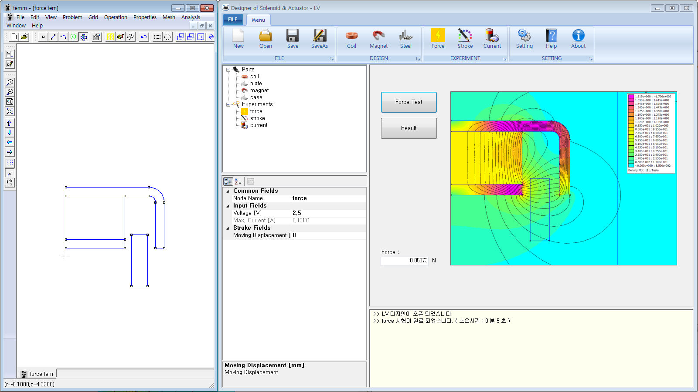
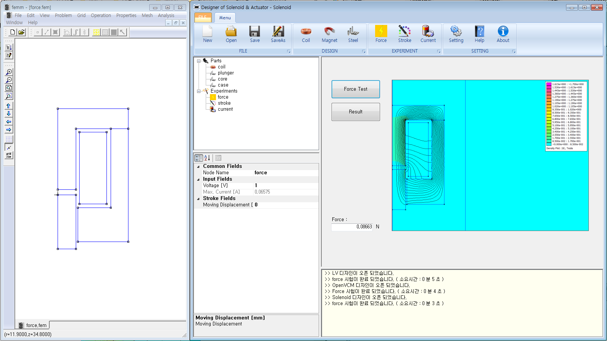
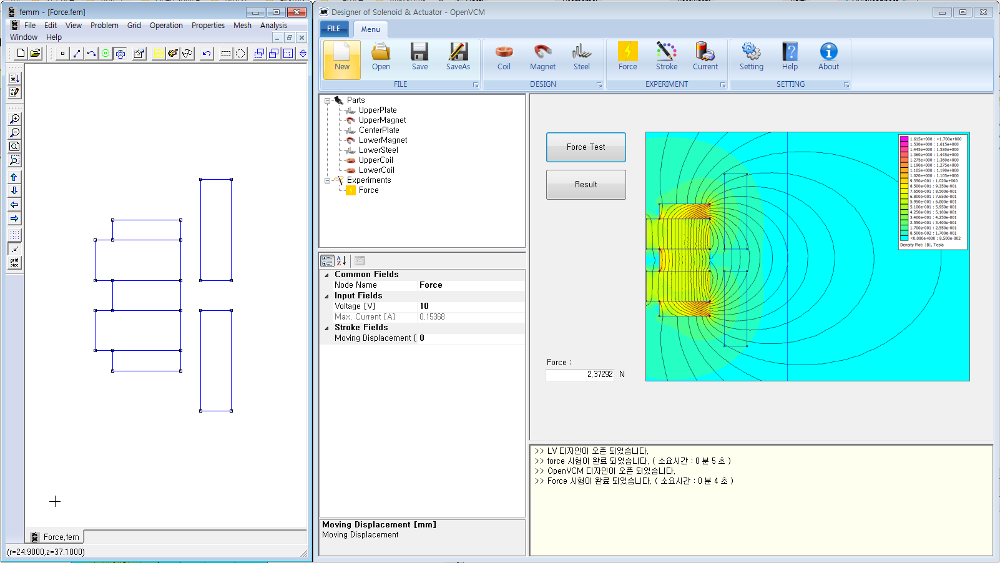
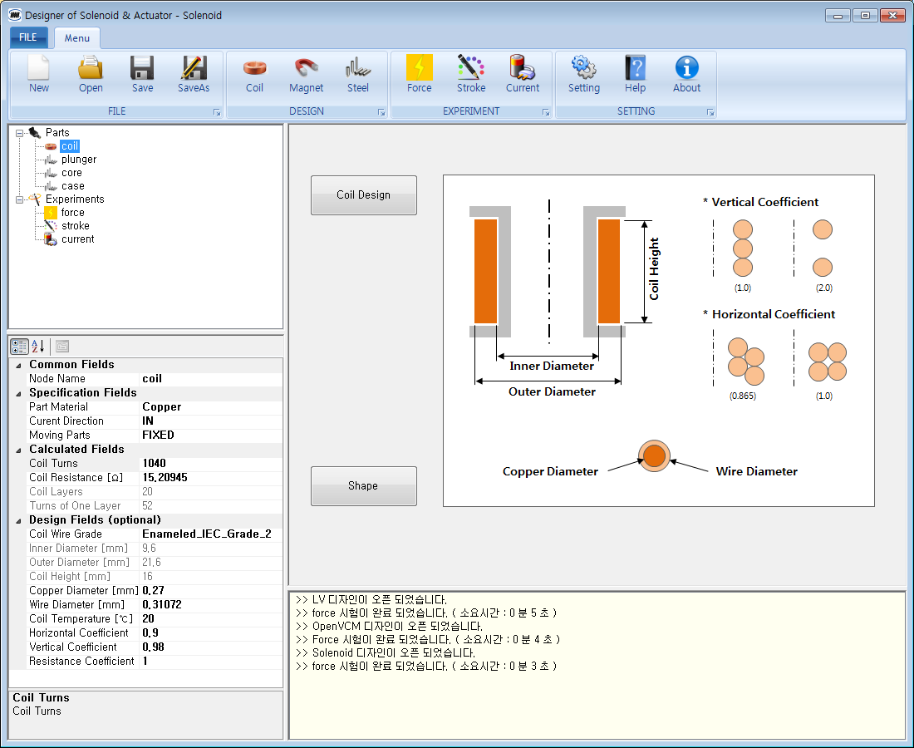

# DoSA-2D (Ver 1.1.6)

This program is an open source software for solenoids &amp; actuator

1. Introduction Video : https://youtu.be/dVtxgqTuSkM  
2. Installation Video : https://youtu.be/323tNuSe6DI  
3. Board : <a href="https://solenoid.or.kr/direct_eng.php?address=https://solenoid.or.kr/gtzero1/gt_zboard.php?id=open_cae_eng">DoSA-2D Q&A and Data Board</a> 
4. Homepage : <a href="https://solenoid.or.kr/index_dosa_open_2d_eng.html">DoSA-2D Homepage Link</a> 
  

div>
